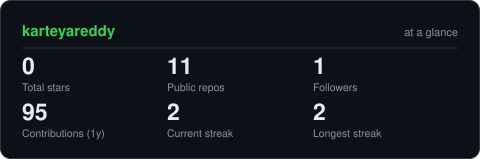
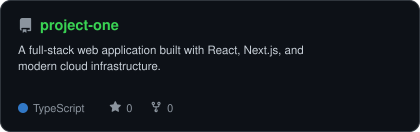
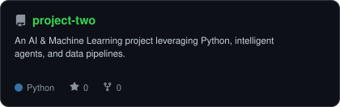
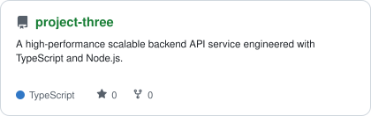
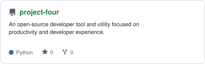

<div align="center">

<!-- PORTRAIT - clean circular photo avatar -->


<br>

<!-- NAME / TAGLINE - animated typing -->
<a href="https://github.com/karteyareddy">
  
</a>

<br>

<!-- SOCIALS -->
<a href="https://www.linkedin.com/in/kristipati-karteya-reddy-947247136/"></a>
<a href="mailto:reddykarteya@gmail.com"></a>
<a href="https://github.com/karteyareddy"></a>


</div>

---

## `~/` whoami

```console
$ cat about.txt
```

Hi, I'm **Karteya Reddy**. I build software at the intersection of full-stack web development and artificial intelligence,
and I solve problems for fun when neither of those is cooperating.

- Currently building **[Full-Stack & AI Apps](https://github.com/karteyareddy)**
- Learning **Next.js & Machine Learning Systems**
- Fun fact: **I love building clean, scalable solutions to complex problems.**

<br>

<div align="center">

## `~/` toolbox


</div>

---

<div align="center">

## `~/` skill radar

<table>
<tr>
<td width="50%" align="center" valign="middle">

<!-- Self-rated radar - edit assets/skills.json, the workflow redraws it -->
<picture>
  <source media="(prefers-color-scheme: dark)"  srcset="assets/radar-dark.svg">
  <source media="(prefers-color-scheme: light)" srcset="assets/radar-light.svg">
  
</picture>

</td>
<td width="50%" align="center" valign="middle">

<!-- Live radar built from real language byte counts across your repos -->
<picture>
  <source media="(prefers-color-scheme: dark)"  srcset="assets/radar-langs-dark.svg">
  <source media="(prefers-color-scheme: light)" srcset="assets/radar-langs-light.svg">
  
</picture>

</td>
</tr>
</table>

</div>

---

<div align="center">

## `~/` contribution calendar

<!-- 3D isometric calendar, regenerated every 6h by .github/workflows/metrics.yml -->


<br><br>

<!-- Snake eats the contribution graph - .github/workflows/snake.yml -->
<picture>
  <source media="(prefers-color-scheme: dark)"  srcset="https://raw.githubusercontent.com/karteyareddy/karteyareddy/output/snake-dark.svg">
  <source media="(prefers-color-scheme: light)" srcset="https://raw.githubusercontent.com/karteyareddy/karteyareddy/output/snake.svg">
  
</picture>

</div>

---

<div align="center">

## `~/` the numbers

<!-- Generated by scripts/cards.py into this repo. -->
<picture>
  <source media="(prefers-color-scheme: dark)"  srcset="assets/card-stats-dark.svg">
  <source media="(prefers-color-scheme: light)" srcset="assets/card-stats-light.svg">
  
</picture>

<br>


<br><br>


</div>

---

<div align="center">

## `~/` selected work

<!-- Cards generated by scripts/cards.py from assets/projects.json. -->
<table>
<tr>
<td width="50%">
  <a href="https://github.com/karteyareddy/project-one">
    <picture>
      <source media="(prefers-color-scheme: dark)"  srcset="assets/card-project-one-dark.svg">
      <source media="(prefers-color-scheme: light)" srcset="assets/card-project-one-light.svg">
      
    </picture>
  </a>
</td>
<td width="50%">
  <a href="https://github.com/karteyareddy/project-two">
    <picture>
      <source media="(prefers-color-scheme: dark)"  srcset="assets/card-project-two-dark.svg">
      <source media="(prefers-color-scheme: light)" srcset="assets/card-project-two-light.svg">
      
    </picture>
  </a>
</td>
</tr>
<tr>
<td width="50%">
  <a href="https://github.com/karteyareddy/project-three">
    <picture>
      <source media="(prefers-color-scheme: dark)"  srcset="assets/card-project-three-dark.svg">
      <source media="(prefers-color-scheme: light)" srcset="assets/card-project-three-light.svg">
      
    </picture>
  </a>
</td>
<td width="50%">
  <a href="https://github.com/karteyareddy/project-four">
    <picture>
      <source media="(prefers-color-scheme: dark)"  srcset="assets/card-project-four-dark.svg">
      <source media="(prefers-color-scheme: light)" srcset="assets/card-project-four-light.svg">
      
    </picture>
  </a>
</td>
</tr>
</table>

<sub>

| project | stack |
|---|---|
| **[project-one](https://github.com/karteyareddy/project-one)** | `React` `Next.js` |
| **[project-two](https://github.com/karteyareddy/project-two)** | `Python` `Machine Learning` |
| **[project-three](https://github.com/karteyareddy/project-three)** | `Node.js` `TypeScript` |
| **[project-four](https://github.com/karteyareddy/project-four)** | `Python` `Open Source` |

</sub>

</div>

---

<div align="center">

<sub>`01110100 01101000 01100001 01101110 01101011 01101101 00100000 01100110 01101111 01110010 00100000 01110011 01100011 01110010 01101111 01101100 01101100 01101001 01101110 01100111`</sub>

</div>
