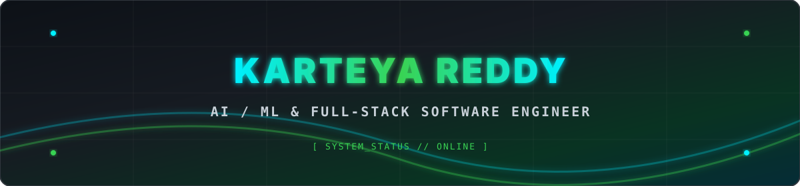
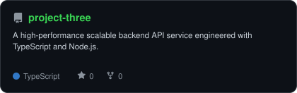
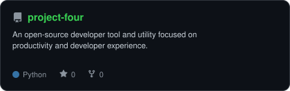

<div align="center">

<!-- TOP HERO BANNER -->
<p align="center">
  
</p>

<br>

<!-- SQUARE PHOTO AVATAR WITH NEON BORDER -->
<a href="https://github.com/karteyareddy">
  
</a>

<br><br>

<!-- ANIMATED TYPING BANNER -->
<a href="https://github.com/karteyareddy">
  
</a>

<br><br>

<!-- CYBER HUD STATUS BADGES -->
<p align="center">
  
  
  
</p>

<!-- SOCIAL BADGES -->
<p align="center">
  <a href="https://www.linkedin.com/in/kristipati-karteya-reddy-947247136/">
    
  </a>
  <a href="mailto:reddykarteya@gmail.com">
    
  </a>
  <a href="https://github.com/karteyareddy">
    
  </a>
</p>

<!-- PROFILE VIEWS -->
<p align="center">
  
</p>

</div>

---

## ⚡ `~/whoami.sh` — TERMINAL MATRIX

```console
karteyareddy@cyberdeck:~$ ./whoami.sh --verbose --mode=full
```

```json
{
  "developer": "Karteya Reddy",
  "title": "Software Engineer (AI / ML & Full-Stack)",
  "mission": "Engineering intelligent, high-throughput systems at the edge of Web & Artificial Intelligence",
  "active_stack": {
    "languages": ["Python", "TypeScript", "JavaScript", "C++", "SQL"],
    "frameworks": ["React", "Next.js", "Node.js", "Express", "TailwindCSS"],
    "ai_ml": ["PyTorch", "TensorFlow", "OpenCV", "LLM Fine-tuning", "Neural Networks"],
    "cloud_data": ["PostgreSQL", "MongoDB", "Docker", "Git / GitHub Actions"]
  },
  "status": "Architecting autonomous systems & full-stack web applications 🚀"
}
```

<br>

- 🔭 **Currently Building**: Advanced AI / ML agents & scalable web platforms
- 🌱 **Learning & Researching**: LLM architectures, distributed backend scaling, and Next.js 14 App Router
- 💬 **Ask me about**: Full-stack web architecture, Python AI pipelines, and API performance optimization
- ⚡ **Fun Fact**: *"I solve complex engineering problems for fun when algorithms refuse to cooperate."*

---

## 🛠️ `~/toolbox` — TECH MATRIX

<div align="center">

### 🧠 AI / ML & Data Science


### ⚡ Frontend & Web Architecture


### 🛡️ Backend, Cloud & Databases


### 🛠️ Developer Ecosystem


</div>

---

## 📊 `~/analytics` — SKILL RADAR & METRICS

<div align="center">

<table>
<tr>
<td width="50%" align="center" valign="middle">
  <p align="center"><b>🎯 SELF-RATED SKILL RADAR</b></p>
  <picture>
    <source media="(prefers-color-scheme: dark)" srcset="assets/radar-dark.svg">
    <source media="(prefers-color-scheme: light)" srcset="assets/radar-light.svg">
    
  </picture>
</td>
<td width="50%" align="center" valign="middle">
  <p align="center"><b>📈 LIVE REPOSITORY LANGUAGE MIX</b></p>
  <picture>
    <source media="(prefers-color-scheme: dark)" srcset="assets/radar-langs-dark.svg">
    <source media="(prefers-color-scheme: light)" srcset="assets/radar-langs-light.svg">
    
  </picture>
</td>
</tr>
</table>

</div>

---

## 🚀 `~/selected-work` — FEATURED PROJECTS

<div align="center">

<table>
<tr>
<td width="50%">
  <a href="https://github.com/karteyareddy/project-one">
    <picture>
      <source media="(prefers-color-scheme: dark)" srcset="assets/card-project-one-dark.svg">
      <source media="(prefers-color-scheme: light)" srcset="assets/card-project-one-light.svg">
      
    </picture>
  </a>
</td>
<td width="50%">
  <a href="https://github.com/karteyareddy/project-two">
    <picture>
      <source media="(prefers-color-scheme: dark)" srcset="assets/card-project-two-dark.svg">
      <source media="(prefers-color-scheme: light)" srcset="assets/card-project-two-light.svg">
      
    </picture>
  </a>
</td>
</tr>
<tr>
<td width="50%">
  <a href="https://github.com/karteyareddy/project-three">
    <picture>
      <source media="(prefers-color-scheme: dark)" srcset="assets/card-project-three-dark.svg">
      <source media="(prefers-color-scheme: light)" srcset="assets/card-project-three-light.svg">
      
    </picture>
  </a>
</td>
<td width="50%">
  <a href="https://github.com/karteyareddy/project-four">
    <picture>
      <source media="(prefers-color-scheme: dark)" srcset="assets/card-project-four-dark.svg">
      <source media="(prefers-color-scheme: light)" srcset="assets/card-project-four-light.svg">
      
    </picture>
  </a>
</td>
</tr>
</table>

</div>

---

## 📈 `~/github-telemetry` — LIVE STATS & ACTIVITY

<div align="center">

<!-- 3D ISOMETRIC CALENDAR -->
<p align="center">
  
</p>

<br>

<!-- CONTRIBUTION SNAKE ANIMATION -->
<picture>
  <source media="(prefers-color-scheme: dark)" srcset="https://raw.githubusercontent.com/karteyareddy/karteyareddy/output/snake-dark.svg">
  <source media="(prefers-color-scheme: light)" srcset="https://raw.githubusercontent.com/karteyareddy/karteyareddy/output/snake.svg">
  
</picture>

<br><br>

<!-- GITHUB STATS CARD -->
<picture>
  <source media="(prefers-color-scheme: dark)" srcset="assets/card-stats-dark.svg">
  <source media="(prefers-color-scheme: light)" srcset="assets/card-stats-light.svg">
  
</picture>

<br><br>

<!-- LANGUAGE DISTRIBUTION & ACHIEVEMENTS -->

<br><br>


</div>

---

<div align="center">

```console
[TERMINAL CLOSED] :: THANKS FOR VISITING // KARTEYA REDDY ⚡
```

<sub>`01101011 01100001 01101110 01101110 01100001 00100000 01110010 01100101 01100100 01100100 01111001`</sub>

</div>
